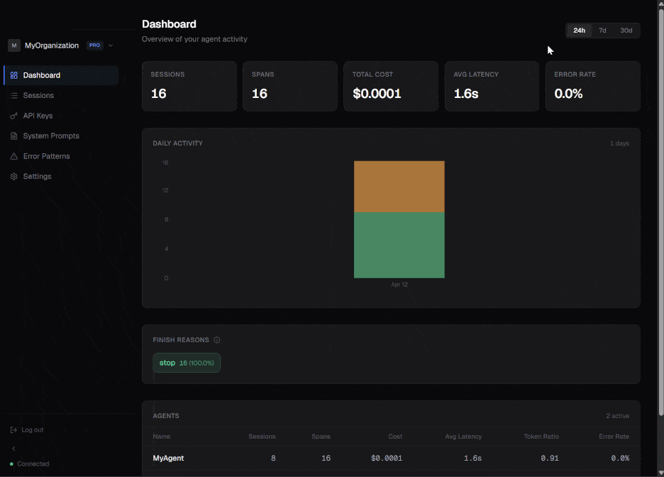
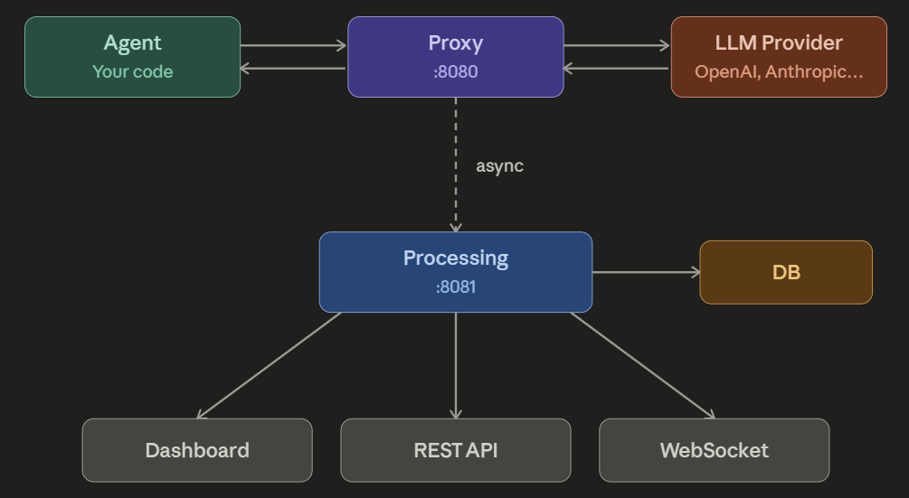

<div align="center">

# AgentOrbit

**Drop-in observability for AI agents. Just swap the `base_url`.**

[](https://github.com/agentorbit-tech/agentorbit/actions/workflows/ci.yml)
[](https://codecov.io/gh/agentorbit-tech/agentorbit)
[](https://goreportcard.com/report/github.com/agentorbit-tech/agentorbit/processing)
[](https://github.com/orgs/agentorbit-tech/packages)

[Quick Start](#-quick-start) · [How it works](#-how-it-works) · [Connect an agent](#-connect-your-agent) · [Self-hosting](docs/deployment-guide.md) · [Contributing](docs/CONTRIBUTING.md)



</div>

---

AgentOrbit sits between your AI agent and the LLM provider as a **transparent proxy**. It streams the provider response back unchanged, and in parallel records every request as a span — grouping spans into sessions, estimating cost, generating narratives, surfacing failures, and serving a real-time dashboard.

- **Zero code changes** — point your SDK at AgentOrbit and keep shipping.
- **Unchanged responses** — SSE chunks are passed through without buffering.
- **Fail-open** — if the observability layer is down, your agent keeps working.
- **Self-host first** — three containers, no Redis, no Kafka, no external queue.

## ✨ Features

| | |
|---|---|
| **Transparent proxy** | OpenAI- and Anthropic-compatible endpoints, < 50 ms overhead |
| **Real-time dashboard** | Live sessions, spans, tokens, cost, latency — over WebSocket |
| **LLM-powered narratives** | Auto-generated summaries of what each agent session did |
| **Failure clusters & alerts** | Group related errors, notify on patterns |
| **Secure by default** | API keys stored as HMAC digests, provider keys AES-256-GCM encrypted |
| **Multi-tenant** | Organization-scoped, with invitations and roles |
| **CSV export** | Session- and span-level exports with filters applied |
| **One-command deploy** | `docker compose up -d` ships the whole stack |

## 🚀 Quick Start

Requires Docker 24+ and Docker Compose v2.

```bash
git clone https://github.com/agentorbit-tech/agentorbit.git
cd agentorbit
cp .env.example .env

# Generate secure secrets
sed -i "s/changeme_jwt_secret_min_32_chars_long/$(openssl rand -hex 32)/" .env
sed -i "s/changeme_hmac_secret_min_32_chars_long/$(openssl rand -hex 32)/" .env
sed -i "s/changeme_generate_64_hex_chars_openssl_rand_hex_32_output_here/$(openssl rand -hex 32)/" .env
sed -i "s/changeme_internal_token_min_32_chars/$(openssl rand -hex 32)/" .env
sed -i "s/changeme_db_password/$(openssl rand -hex 16)/" .env

docker compose up -d
```

Then open:

| Service | URL |
|---|---|
| 📈 Dashboard | http://localhost:8081 |
| 🔌 Proxy endpoint | http://localhost:8080 |

Register the first user on the dashboard — in self-host mode they are auto-verified.

## 🧭 How It Works

<div align="center">
  
</div>

| Service | Role |
|---|---|
| **Proxy** | Stateless. Forwards requests to the upstream LLM, streams SSE without buffering, emits span data to Processing async. Fail-open. |
| **Processing** | REST API + WebSocket + async workers (narratives, classification, alerts). Runs migrations on startup. Embeds the frontend SPA. |
| **Frontend** | React 19 SPA, dark theme, compiled into the Processing binary via `embed.FS`. |
| **PostgreSQL** | Single source of truth. No Redis, no external queue. |

Internal API between Proxy ↔ Processing is secured by a shared `X-Internal-Token` header.

## 🔌 Connect Your Agent

Any OpenAI- or Anthropic-compatible client works — just swap `base_url` and use your AgentOrbit API key (`ao-...`).

### OpenAI SDK (Python)

```python
from openai import OpenAI

client = OpenAI(
    api_key="ao-...",                       # Your AgentOrbit API key
    base_url="http://localhost:8080/v1",
)

response = client.chat.completions.create(
    model="gpt-4o",
    messages=[{"role": "user", "content": "Hello"}],
)
```

### Anthropic SDK (Python)

```python
import anthropic

client = anthropic.Anthropic(
    api_key="ao-...",
    base_url="http://localhost:8080",
)

message = client.messages.create(
    model="claude-sonnet-4-20250514",
    max_tokens=1024,
    messages=[{"role": "user", "content": "Hello"}],
)
```

### Supported endpoints

| Endpoint | Provider |
|---|---|
| `POST /v1/chat/completions` | OpenAI-compatible |
| `POST /v1/messages` | Anthropic-compatible |

### Group requests into sessions

Add the `X-AgentOrbit-Session` header with any ID you control, and AgentOrbit will bundle those spans into one session. Without the header, spans are auto-grouped by API key + idle timeout.

## ⚙️ Configuration

Configuration is environment-based. See [`.env.example`](.env.example) for the full list.

### Required

| Variable | Purpose |
|---|---|
| `POSTGRES_PASSWORD` | Database password |
| `DATABASE_URL` | PostgreSQL connection string |
| `JWT_SECRET` | HS256 signing key (min 32 chars) |
| `HMAC_SECRET` | API-key hashing secret (min 32 chars) |
| `ENCRYPTION_KEY` | AES-256-GCM key for provider keys (64 hex chars) |
| `INTERNAL_TOKEN` | Proxy ↔ Processing shared secret (min 32 chars) |

### Optional

| Variable | Default | Purpose |
|---|---|---|
| `PROCESSING_PORT` | `8081` | Processing service port |
| `PROXY_PORT` | `8080` | Proxy service port |
| `JWT_TTL_DAYS` | `30` | JWT token expiration |
| `PROVIDER_TIMEOUT_SECONDS` | `120` | Upstream LLM timeout |
| `ALLOWED_ORIGINS` | — | CORS origins (comma-separated) |
| `DATA_RETENTION_DAYS` | `0` | Auto-delete spans older than N days (0 = keep forever) |
| `PROCESSING_LLM_BASE_URL` | — | LLM endpoint for narratives/clustering |
| `PROCESSING_LLM_API_KEY` | — | LLM API key for narratives/clustering |
| `PROCESSING_LLM_MODEL` | — | LLM model for narratives/clustering |
| `SMTP_HOST`, `SMTP_PORT`, … | — | Email delivery (optional) |

Without `PROCESSING_LLM_*`, narratives fall back to concatenated inputs and clustering is deterministic.

## 📁 Project Structure

```
agentorbit/
├── proxy/          # Stateless proxy service (Go, chi)
├── processing/     # Stateful API + workers (Go, chi, sqlc, golang-migrate)
├── web/            # SPA dashboard (Vite, React 19, TS, Tailwind v4)
├── docs/           # Architecture and deployment guides
├── scripts/        # Smoke tests, load tests, security audits
└── docker-compose.yml
```

## 🛠️ Development

### Prerequisites

- Go **1.26+**
- Node.js **22+**
- PostgreSQL **17**

### Run locally

```bash
# 1. Start PostgreSQL (or just: docker compose up -d postgres)

# 2. Processing service
cd processing
DATABASE_URL="postgres://..." go run ./cmd/processing

# 3. Proxy service
cd proxy
PROCESSING_URL="http://localhost:8081" go run ./cmd/proxy

# 4. Frontend dev server
cd web
npm install
npm run dev
```

### Useful scripts

| Script | What it does |
|---|---|
| `scripts/smoke-test.sh` | End-to-end: register → login → create org → ingest span → verify |
| `scripts/test-isolation.sh` | 22-check organization isolation audit |
| `scripts/test-load.sh` | Load test with goroutine-bounds checking |
| `scripts/audit-logs.sh` | Scan logs for leaked secrets |
| `scripts/reset.sh` | Destroy all data and rebuild from scratch |

## 🧱 Tech Stack

| Layer | Technology |
|---|---|
| Proxy | Go 1.26, `go-chi/chi v5` |
| Processing | Go 1.26, `chi`, `sqlc`, `golang-migrate`, `pgx/v5`, `coder/websocket` |
| Frontend | Vite 6, React 19, TypeScript 5, Tailwind v4, TanStack Query v5, Zustand, Recharts, shadcn/ui |
| Database | PostgreSQL 17 |
| Auth | JWT (HS256) + API keys (HMAC-SHA256) |

## 🔐 Security

- API keys stored as HMAC-SHA256 digests — never in plaintext.
- Provider API keys encrypted at rest with AES-256-GCM.
- All resources are organization-scoped. No cross-org access.
- Internal API secured by shared secret and may be firewalled by IP.
- API keys, passwords, full LLM I/O, and JWT secrets are **never logged**.

Report vulnerabilities per [`docs/SECURITY.md`](docs/SECURITY.md).

## 🚢 Self-Hosting

Full guide: [`docs/deployment-guide.md`](docs/deployment-guide.md).

Covers:

- System requirements (from 1 CPU / 1 GB RAM for small workloads)
- Reverse proxy (nginx / Caddy) setup with HTTPS
- Backup & restore (`pg_dump` / `pg_restore`)
- Data retention policy
- Upgrade procedure

Prebuilt images are published to GHCR on every tagged release:

- `ghcr.io/agentorbit-tech/agentorbit-proxy:latest`
- `ghcr.io/agentorbit-tech/agentorbit-processing:latest`

## 🤝 Contributing

Contributions are welcome — see [`docs/CONTRIBUTING.md`](docs/CONTRIBUTING.md) and the [code of conduct](docs/CODE_OF_CONDUCT.md).

## 📜 License

[MIT](LICENSE.md) © 2026 Andrey Dolgikh
